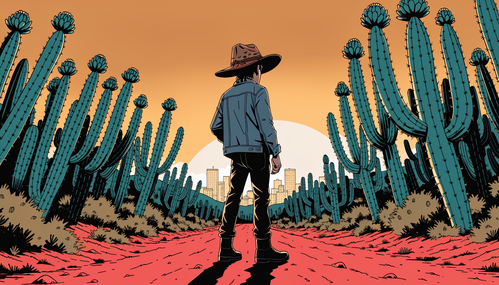

# Bem-vindo ao Nordeste RP

<figure><figcaption></figcaption></figure>

Esta é a documentação oficial de regras do **Nordeste Roleplay**. Aqui está reunido tudo o que você precisa para jogar na cidade: como se comportar no RP, o que é permitido em cada ação, como funcionam as advertências e por onde abrir uma denúncia.


**Desconhecer uma regra não isenta de punição.** Ao entrar na cidade você concorda com tudo o que está descrito nesta documentação. Leia com calma antes de jogar.


***

### Comece por aqui

<table data-view="cards"><thead><tr><th></th><th data-type="content-ref"></th><th data-hidden data-type="content-ref"></th></tr></thead><tbody><tr><td>A regra que está acima de todas as outras</td><td><a href="leia-atentamente/regra-primordial-bom-senso.md">regra-primordial-bom-senso.md</a></td><td></td></tr><tr><td>Como funcionam advertências, banimentos e unban</td><td><a href="leia-atentamente/advertências-e-punições.md">advertências-e-punições.md</a></td><td></td></tr><tr><td>Viu alguém quebrando regra? Abra um ticket</td><td><a href="denúncias/denúncias-via-ticket.md">denúncias-via-ticket.md</a></td><td></td></tr></tbody></table>

***

### Navegue pelas regras

<table data-view="cards"><thead><tr><th></th><th></th><th data-hidden data-card-cover data-type="files"></th><th data-hidden data-type="content-ref"></th></tr></thead><tbody><tr><td><strong>LEIA ATENTAMENTE</strong></td><td>Conduta geral, respeito e o que se espera de você dentro do RP.</td><td><a href=".gitbook/assets/capa-leia-atentamente.png">capa-leia-atentamente.png</a></td><td><a href="README (1).md">README (1).md</a></td></tr><tr><td><strong>REGRAS BÁSICAS DE RP</strong></td><td>RDM, VDM, Meta-Gaming, Power Gaming, New Life Rule e todo o resto.</td><td><a href=".gitbook/assets/capa-regras-basicas.png">capa-regras-basicas.png</a></td><td><a href="regras-básicas-de-rp/regras-básicas-de-rp.md">regras-básicas-de-rp.md</a></td></tr><tr><td><strong>REGRAS DE AÇÕES</strong></td><td>Da lojinha ao Banco Central — requisitos, armas e limites de cada ação.</td><td><a href=".gitbook/assets/capa-acoes.png">capa-acoes.png</a></td><td><a href="regras-de-ações/regras-de-ações.md">regras-de-ações.md</a></td></tr><tr><td><strong>REGRAS POLICIAIS</strong></td><td>Como a polícia deve agir em abordagens, perseguições e ações.</td><td><a href=".gitbook/assets/capa-policiais.png">capa-policiais.png</a></td><td><a href="regras-policiais/regras-policiais.md">regras-policiais.md</a></td></tr><tr><td><strong>INVASÕES MARCADAS</strong></td><td>Território, baque e conflito entre facções.</td><td><a href=".gitbook/assets/capa-faccoes.png">capa-faccoes.png</a></td><td><a href="invasoes-marcadas.md">invasoes-marcadas.md</a></td></tr><tr><td><strong>SEQUESTRO E NEGOCIAÇÃO</strong></td><td>O que pode e o que não pode ao fazer refém e ao negociar.</td><td><a href=".gitbook/assets/capa-sequestro.png">capa-sequestro.png</a></td><td><a href="regras-de-sequestro.md">regras-de-sequestro.md</a></td></tr><tr><td><strong>DENÚNCIAS</strong></td><td>Como denunciar, o que anexar como prova e como funciona a telagem.</td><td><a href=".gitbook/assets/capa-denuncias.png">capa-denuncias.png</a></td><td><a href="denúncias/denúncias.md">denúncias.md</a></td></tr></tbody></table>

***

### A cidade em ação

Antes de entrar, veja como o RP acontece no Nordeste. Estes são episódios completos gravados na nossa cidade:


LOUD Coringa no Nordeste RP — momentos engraçados



Coringa conhecendo o Nordeste Roleplay, o 1º servidor nordestino



Elgato no Nordeste RP — gameplay completa


***

### Precisa de ajuda?


Dúvida sobre uma regra, denúncia ou punição? Fale com a equipe no Discord oficial da cidade.

[**Entrar no Discord do Nordeste RP**](https://discord.gg/nordesteroleplay)

