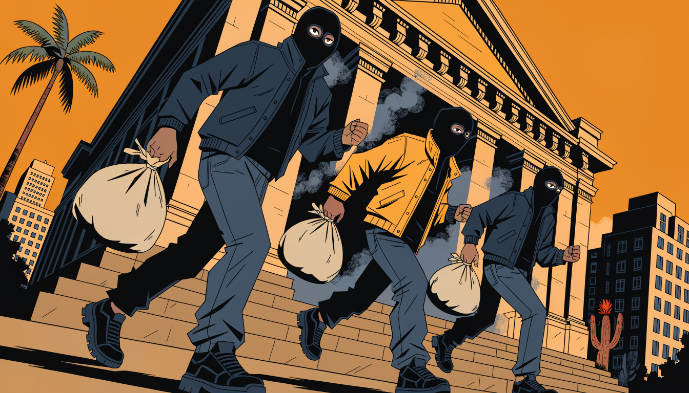

# REGRAS DE AÇÕES

<figure><figcaption></figcaption></figure>

### Ações por porte

<table><thead><tr><th width="170">Porte</th><th>Ações</th></tr></thead><tbody>
<tr><td><strong>🟢 Pequeno</strong></td><td><a href="./lojinha.md"><strong>LOJINHA</strong></a> · <a href="./fast-food.md"><strong>🍴 FAST FOOD</strong></a> · <a href="./est%C3%A1bulo.md"><strong>ESTÁBULO</strong></a> · <a href="./navio-de-cargas.md"><strong>NAVIO DE CARGAS</strong></a> · <a href="./barbearia.md"><strong>BARBEARIA</strong></a> · <a href="./ammunation.md"><strong>AMMUNATION</strong></a> · <a href="./caixa-eletr%C3%B4nico-registradora.md"><strong>CAIXA ELETRÔNICO / REGISTRADORA</strong></a> · <a href="./venda-de-drogas.md"><strong>VENDA DE DROGAS</strong></a> · <a href="./mergulhador.md"><strong>MERGULHADOR</strong></a> · <a href="./yellow-jack.md"><strong>YELLOW JACK</strong></a></td></tr>
<tr><td><strong>🟡 Médio</strong></td><td><a href="./hollywood.md"><strong>HOLLYWOOD</strong></a> · <a href="./life-invader.md"><strong>LIFE INVADER</strong></a> · <a href="./a%C3%A7ougue.md"><strong>AÇOUGUE</strong></a> · <a href="./galinheiro.md"><strong>GALINHEIRO</strong></a> · <a href="./joalheria.md"><strong>JOALHERIA</strong></a></td></tr>
<tr><td><strong>🔴 Grande</strong></td><td><a href="./ni%C3%B3bio.md"><strong>NIÓBIO</strong></a> · <a href="./banco-central.md"><strong>BANCO CENTRAL</strong></a> · <a href="./banco-do-rio-grande-do-norte.md"><strong>BANCO DO RIO GRANDE DO NORTE</strong></a></td></tr>
<tr><td><strong>⚪ Gerais</strong></td><td><a href="./bancos-fleeca.md"><strong>BANCOS FLEECA</strong></a> · <a href="./assaltos.md"><strong>ASSALTOS</strong></a> · <a href="./regras-de-assalto-norte.md"><strong>REGRAS DE ASSALTO NORTE</strong></a> · <a href="./furtos-a-veiculos.md"><strong>FURTOS A VEÍCULOS</strong></a> · <a href="./fugas.md"><strong>FUGAS</strong></a> · <a href="./helicrash.md"><strong>HELICRASH</strong></a></td></tr>
</tbody></table>

***

## 1. Colaboração e Parcerias

* **É proibida qualquer ação conjunta entre:**
  * Membros de facções diferentes.
  * Facções e máfias.
  * Máfias diferentes (proibido QRR/parceria entre facções ou máfias).

## 2. Uso de Equipamentos e Condutas

1. **Máscaras e Capacetes:**
   * É proibido o uso de capacetes em qualquer ação, incluindo ações de rua.
   * Reféns não podem ser reconhecidos ou identificados pela voz ou vestimenta caso estejam usando máscaras.
2. **Identificação Pós-Ação:**
   * Caso o ladrão não esteja usando máscara durante a ação, ele poderá ser reconhecido posteriormente, mesmo que troque de roupa.
3. **Abuso de Animações:**
   * É proibido utilizar ou abusar de animações para obter vantagens em ações, como:
     * Bind de dormir para desviar tiros ou atravessar estruturas.
4. **Looting Indevido:**
   * É proibido saquear corpos em ações das quais você não participou, caracterizando loot indevido.
5. **Utilização do /medico**
   * É proibida a utilização do /medico DURANTE qualquer ação de rua ou puxada.
6. **Utilização do “Reanimar” e/ou adrenalina**
   * É proibido a utilização do target "reanimar" ou do item adrenalina DURANTE qualquer ação de rua ou puxada.

## 3. Regras para Reféns e Negociações

1. **Condutas com Reféns:**
   * Reféns não podem ter nenhuma conexão com os sequestradores.
   * Após rendição ou atendimento médico, é proibida qualquer continuidade da ação ou resgate.
   * Reféns devem seguir a história e obedecer as ordens no RP. Caso contrário, podem ser executados.
2. **Negociações:**
   * Negociações entre policiais e criminosos são obrigatórias em ações premeditadas.
   * Ambas as partes devem respeitar os termos acordados.
   * Ações que precisam de negociação: Banco do Rio Grande Norte, Banco Central, Joalheria, Bancos Fleeca.

## 4. Regras para Pós-Ação e Atendimento Médico

1. **Equipe Médica:**
   * É proibido matar a equipe médica.
   * A equipe médica só pode ser chamada após o término completo da ação.
   * Caso interfira em uma ação ainda em andamento, o paramédico estará sujeito a advertência.
2. **Proibição de Continuidade:**
   * Após o início do atendimento médico, qualquer resgate ou continuidade da ação é proibido.

## 5. Fugas e Perseguições

1. **Uso de Veículos:**
   * Durante perseguições, é proibido:
     * Continuar fugindo com menos de 3 pneus; priorize a fuga a pé.
     * Caso solicite apoio (QRR) via rádio, a polícia estará autorizada a usar o taser.
2. **Blindados:**
   * Se um veículo blindado for danificado, o jogador deve:
     * Sair do veículo para se render.
     * Participar de trocas de tiros, caso aplique.

