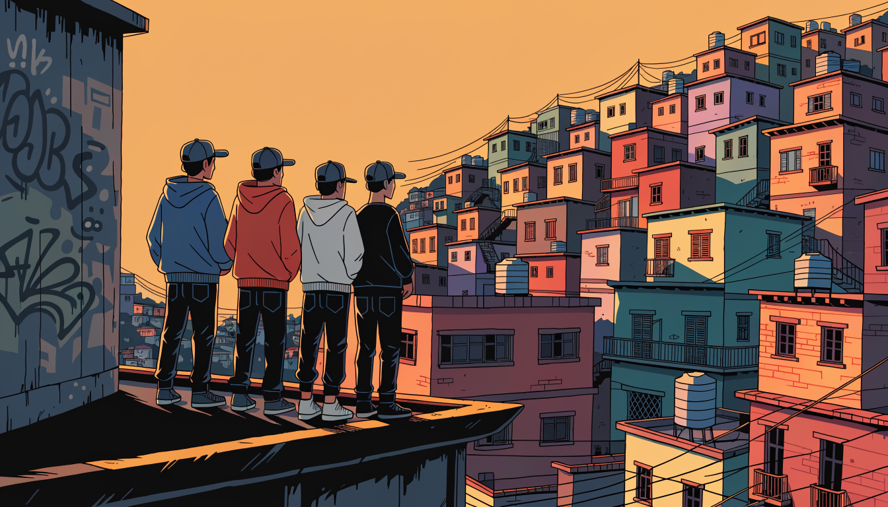

# Regras Nordeste RP

<figure><figcaption></figcaption></figure>

Esta seção reúne as regras de conflito organizado entre grupos: disputa de território, baque em favela, torcidas e vancrash.

<table data-view="cards"><thead><tr><th></th><th data-type="content-ref"></th></tr></thead><tbody>
<tr><td><strong>INVASÕES MARCADAS</strong></td><td><a href="./invasoes-marcadas.md">invasoes-marcadas.md</a></td></tr>
<tr><td><strong>REGRAS DE BAQUE</strong></td><td><a href="./regras-de-baque.md">regras-de-baque.md</a></td></tr>
<tr><td><strong>REGRAS TORCIDA ORGANIZADA</strong></td><td><a href="./regras-torcida-organizada.md">regras-torcida-organizada.md</a></td></tr>
<tr><td><strong>VANCRASH</strong></td><td><a href="./vancrash.md">vancrash.md</a></td></tr>
</tbody></table>

